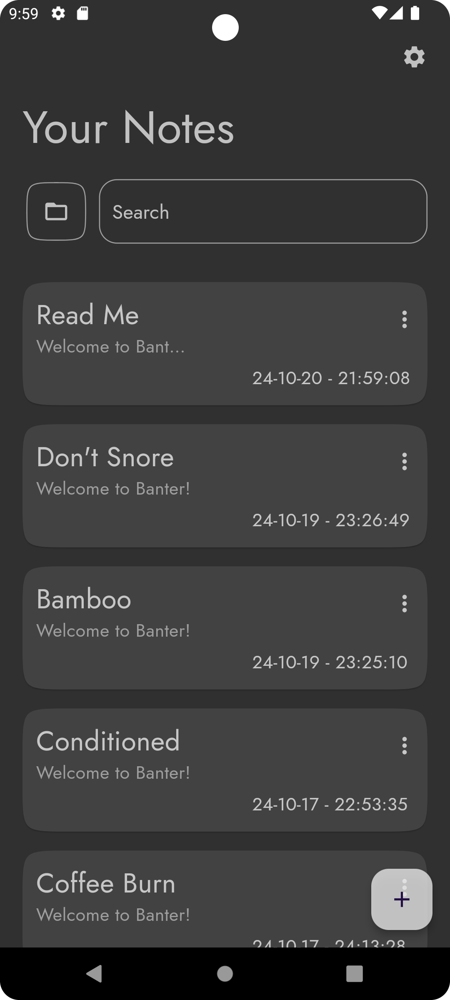

# Banter - Your Next-Generation Note-Taking App 📝

Welcome to **Banter**—a powerful, feature-rich note-taking app built with Flutter that allows you to stay organized, sync across devices, and enjoy an effortless note management experience. Whether you’re jotting down a quick idea or organizing your projects, **Banter** brings simplicity and productivity together with a delightful interface.

## 🚀 Key Features

### 📄 Rich Text Editor
**Banter** includes an easy-to-use and intuitive rich text editor. You can:
- **Bold**, *italicize*, or **_combine both_** for emphasis.
- Organize content with headings, bullet points, numbered lists, and quotes.
- Create checklists to track to-dos or ideas.
- Underline or strikethrough text for more customization and many more.

**Home Screen showing all notes**: See all your notes at a glance.  

### 📁 Organize Notes into Folders (Boxes)
Stay organized by categorizing your notes into **folders** (referred to as "Boxes" within the app). Simply create a folder and drag-and-drop notes for seamless organization.

- Quickly move notes between folders.
- See all notes in a folder at a glance.

**Add to Folder**: 

### 🔄 Sync Across Devices
Never lose your notes! **Banter** includes a built-in **syncing feature** powered by a **Node.js backend** to ensure all your notes are saved securely in the cloud and can be accessed across your devices.

- Secure note sync with cloud storage.
- Seamlessly access notes from any device.

Link to backend sourcecode
- [Node.js backend](https://github.com/Victor-Oluwa/banter-server.git)

**Sync Pop-up**: 

### 💾 Local Storage with Hive
Even when offline, you can continue working with your notes. **Banter** stores all notes locally using **Hive**, a fast and lightweight NoSQL database for Flutter.

- Fast and reliable local storage.
- Offline access to all notes.

### 🏗️ Built with Clean Architecture
Banter is architected with **Clean Architecture** principles, ensuring separation of concerns and maintainability. This provides a strong foundation for future features and updates, and ensures that the codebase is scalable and easy to maintain.

### 📱 State Management with Bloc and Riverpod
For state management, **Banter** utilizes:
- **Bloc** to handle the complex business logic and state transitions.
- **Riverpod** for dependency injection, making the app modular and testable.

### 🌐 GetX for Navigation
**GetX** is used for navigation to ensure smooth and reactive routing between pages and popups. With **GetX**, the navigation stack is handled efficiently, creating a seamless user experience as you move through the app.

### 🛠️ Customizable Notes with a Rich Toolbar
Access a robust toolbar with customizable options like text formatting, adding checklists, and changing headings directly from the editor.

**Rich Text Editor**: 

### 📝 Sample Note for Easy Onboarding
When new users download the app, they are greeted with a default **Welcome Note** that highlights Banter's rich text formatting capabilities and demonstrates how notes can be styled. This note serves as an excellent introduction to the app's potential.

**Welcome Note**: 

**Welcome Note(Scrolled)**: 

---

## 🔧 Tech Stack

**Banter** was built with a variety of cutting-edge technologies to ensure optimal performance, maintainability, and scalability:

- **Flutter & Dart**: The core technologies behind Banter, providing a smooth, cross-platform experience.
- **Hive**: A lightweight, fast NoSQL database for local storage.
- **Node.js**: Backend for syncing notes across devices using cloud services.
- **Bloc**: For managing business logic and state in the app.
- **Riverpod**: A state management solution for dependency injection and making the app more modular.
- **GetX**: Used for navigation and routing within the app.
- **Clean Architecture**: Ensuring a clean, maintainable, and scalable codebase.

---

## 📷 Screenshots

Here are a few screenshots to give you a glimpse of what **Banter** can do:

1. **Home Screen**: See all your notes at a glance. 

   

2. **Welcome Note**: An example of a styled note to introduce new users.  

   
   
   

3. **Rich Text Editor**: Customize your notes with bold, italics, lists, checkboxes, and more using the toolbar. 

   

4. **Sync Pop-up**: Seamlessly sync notes to the cloud for access across devices.  

   

5. **Add to Folder**: Organize your notes by adding them to different folders (boxes).  

   

---

